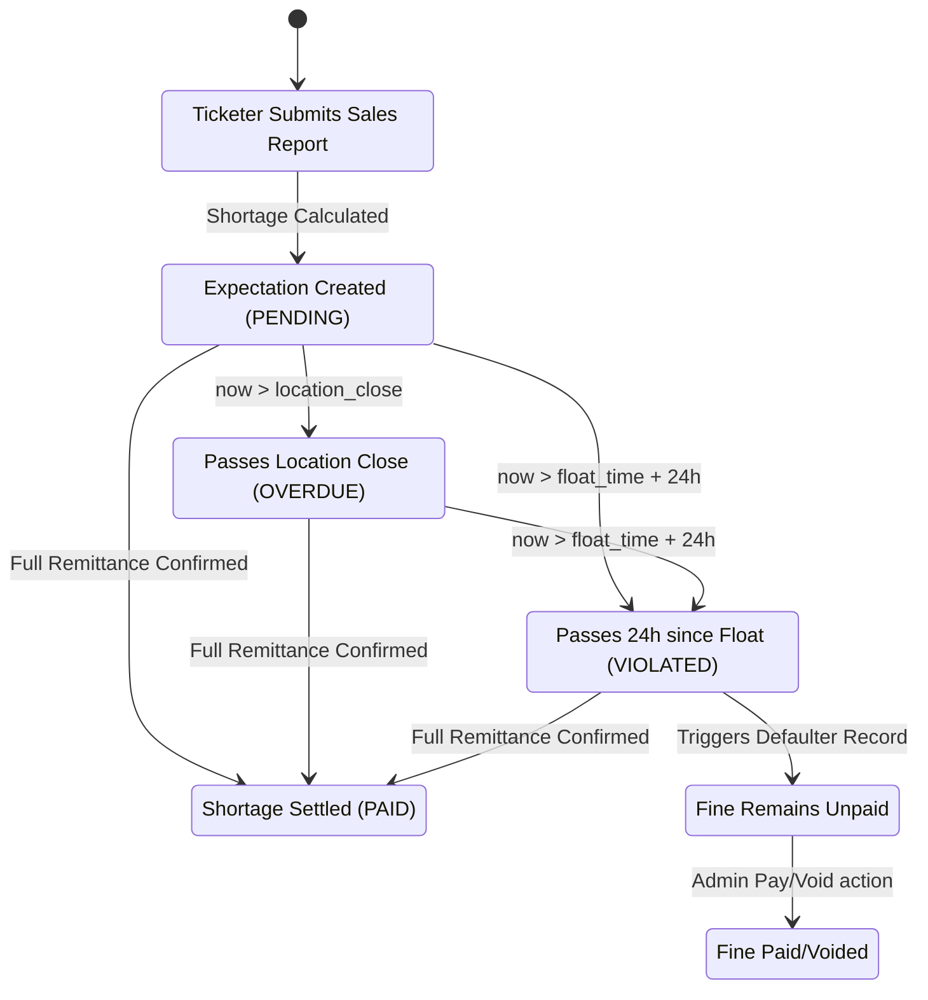

work on the topbar stat like the my sales not correct the my float should be topup 

we should add a alert to the admin for issues where ticketer sales is less then the total allocation or the remited funds so the company dont get excess funds


# Implementation Plan: Reconciliation & Fine Management Architecture

This document outlines the objectives and structural updates for the reconciliation ledger, location scheduling hours, and the dedicated fine system.

---

## 1. Objectives Overview

### 🟩 Part A: POS Device Table & Roster Keys (Resolved)
- **Problem:** React duplicate key warnings in the "My Assigned Locations" table on the POS page.
- **Fix:** Update `GET /api/ticketer/device` to map the row key (`id`) to the unique assignment ID (`la.id`) rather than the location ID. *(Applied by user)*

### 🟦 Part B: Location Operational Hours Update
- **Goal:** Support configuring daily operating schedules for stations to track closing times.
- **Schema:** Store `opening_time` and `closing_time` as nullable strings (`String?`) representing 24h times (e.g., `"08:00"`, `"18:30"`). *(Applied by user)*
- **API updates:** Enhance Location creation and edit endpoints to receive and persist these time strings.
- **UI updates:** Integrate Time pickers (`<input type="time" />`) in the Admin Add/Edit Location drawers.

### 🟨 Part C: Submission-Triggered Reconciliation
- **Goal:** Transition shortage tracking from supervisor verification triggers to ticketer submission triggers.
- **Logic:**
  1. Calculate Expected Cash on end-of-shift sales report submission.
  2. Instantiate a `RemittanceExpectation` in `PENDING` state if a shortage exists.
  3. Combine the assignment date with the location's `closing_time` string to set a strict `due_date` timestamp.
  4. If `now > due_date`, transition the status to `OVERDUE`.

### 🟥 Part D: Float-Bound Violation & Fine Generation
- **Goal:** Penalize cash withholding by marking outstanding shortages as `VIOLATED` if they remain unpaid 24 hours after float allocation.
- **Logic:**
  - Check POS session start (`assigned_at`).
  - If shortage balance $> 0$ after 24 hours from session start $\rightarrow$ set status to `VIOLATED` and trigger a `Fine` record.
  - **Operational rule:** Do not block the ticketer from subsequent allocations (ensure business continuity); accumulate shortages and fines on the ticketer's profile.

### 🟪 Part E: Fine Management Engine
- **Goal:** Process and track fines separately from normal operational remittances.
- **Logic:**
  - Fines are paid in full in one single transaction (no installment/partial payments).
  - Admins and supervisors can cancel/waive fines using a void mechanism.
- **APIs Required:**
  - `GET /api/fines` (returns user-scoped or company-wide list)
  - `POST /api/fines/pay` (marks fine as paid in full)
  - `POST /api/fines/void` (cancels/voids a fine with a logged reason)
- **UI Required:** Dedicated Fines dashboard tab for ticketers to see their debt, and supervisors/admins to clear or void them.

---

## 2. System Architecture & Workflows

### Shift Lifecycle & State Machine



---

## 3. Database Schema Reference

```prisma
model Location {
  id                 String                         @id @default(cuid())
  name               String
  address            String
  opening_time       String?                        // e.g. "06:00"
  closing_time       String?                        // e.g. "18:00"
  created_at         DateTime                       @default(now())
  company_id         String
  sales_reports      SalesReport[]
  ticket_assignments Ticketer_Location_Assignment[]
  company            Company                        @relation(fields: [company_id], references: [id])
}

model Fine {
  id           String      @id @default(cuid())
  defaulter_id String
  amount       Float
  reason       String
  issued_by    String
  status       fine_status @default(UNPAID)
  created_at   DateTime    @default(now())
  company_id   String
  issuer       User        @relation("FineIssuer", fields: [issued_by], references: [id])
  defaulter    User        @relation("FineReceiver", fields: [defaulter_id], references: [id])
  company      Company     @relation(fields: [company_id], references: [id])
}
```

---

## 4. Key Implementation Steps

### Step 1: Location Admin UI Updates
- Modify the Location form component to include:
  ```html
  <input type="time" name="opening_time" />
  <input type="time" name="closing_time" />
  ```
- Modify the POST/PATCH routes in `/api/admin/locations` to accept and write these string properties.

### Step 2: Submission Trigger Integration
- In `/api/sales/route.ts` (where sales reports are submitted), add logic to query current active session allocations.
- Compute the expected cash vs. dropped cash during submission.
- Create/update a `RemittanceExpectation` in a `PENDING` state. Set `due_date` by combining the shift date with `location.closing_time`.

### Step 3: Reconciliation Engine Scheduler
- Build or run a cron-job / background scheduler that checks for:
  - Expectations where `now > due_date` $\rightarrow$ set `status = "OVERDUE"`.
  - Expectations where `now > pos_session.assigned_at + 24 hours` and `shortage > 0` $\rightarrow$ set `status = "VIOLATED"` and insert a `Fine` record.

### Step 4: Fine API Routes
- Implement `GET /api/fines` mapping to the user's role.
- Implement `POST /api/fines/pay` and `POST /api/fines/void` with role verification (must be `SUPERVISOR` or `ADMIN`).

### Step 5: Fines Dashboard UI
- Add a table view mapping the `Fine` objects.
- Add payment & void handlers on the supervisor dashboard to easily trigger `/api/fines/pay` and `/api/fines/void`.


new fix the sales bug where if user did their sales report the next day it get added to the next day sales account and not the previous one  and how do we even know or detect it since this might happen often where both admin and supervisor did not notice the sales record not been submitted or may be they did not have the chance to do so and how do we update sales report on the pos terminal that it for the previous day
